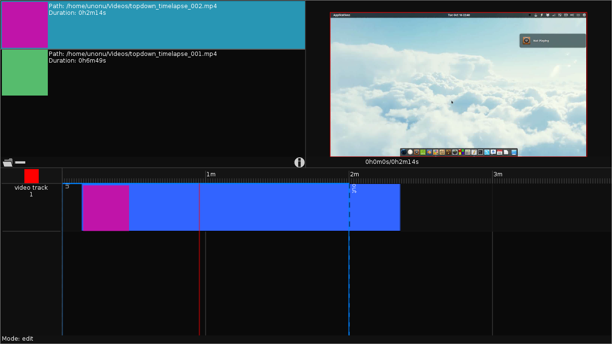

# katana
Compositing, Motion graphics and NLE

Made entirely from scratch with Löve.

Is this what a game engine is supposed
to do? No. But it's working, so I'll
see how far I can take this.

What works?
-----------
- Import video clips
- File browser
- Clip playback
- Tracker/sequencer
- Add tracks
- Place clips to tracks
- Scrubbing

There _was_ a video backend using
external calls to ffmpeg, but that was
the worst, so I ripped it out. Luckily
I made the video backend modular, so
I can drop in a real one later.
Currently, the video backend just
serves colours as frames.

Try It Out
----------
If you want to try it, just download
this repo, and (assumng you have
Löve2D installed) just run `love ./`
at the top level.

Maybe someday I'll switch to GTK+,
but I really enjoy hand writting the
drawing routines.

Still figuring out the License...
